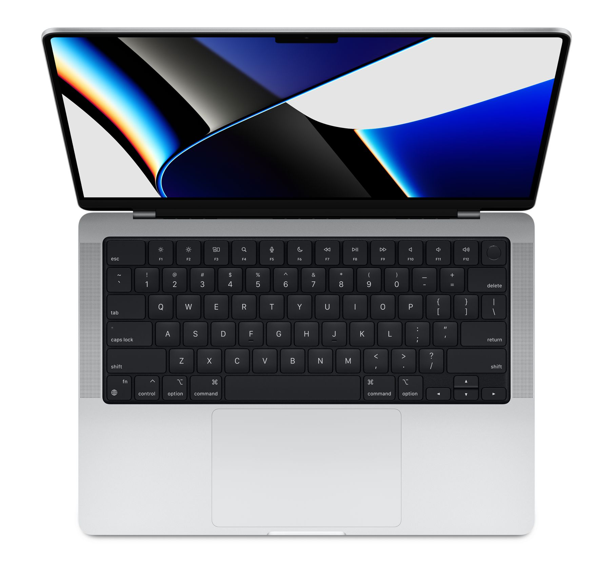
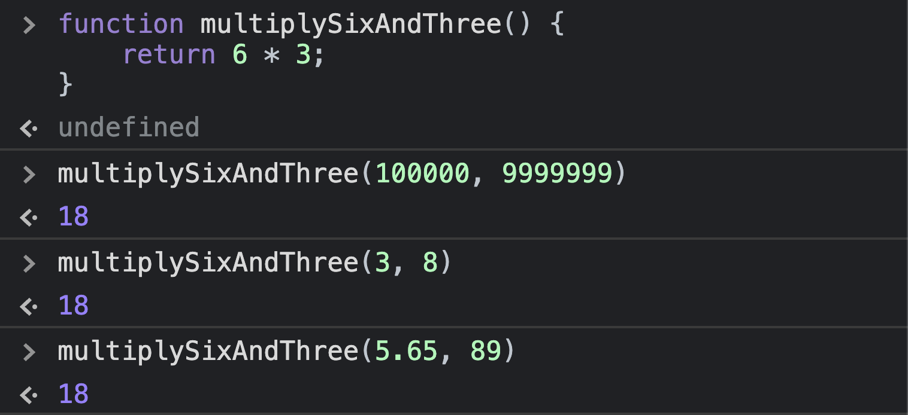
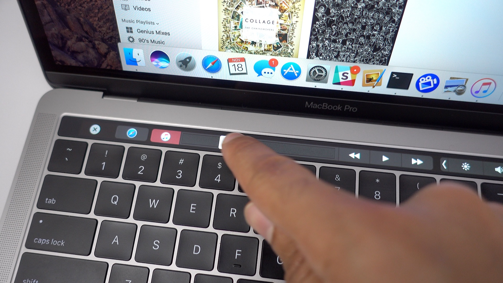
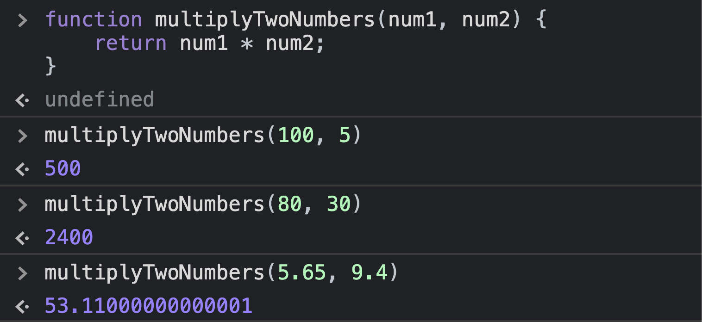

# Analogies for Programming: Hardcoding vs. Abstraction

## Explained with the MacBook Touch Bar

### Audience:

- Programming students who are familiar with functions (sometimes called “methods,” depending on the language) and how they work, and who would like to better understand the concepts of hardcoding and abstraction

- Teachers of programming and anyone interested in having another way to explain these concepts

### Hardcoding is like physical buttons

Many MacBooks–all pre-2016 models as well as some newer ones–come with a row of physical buttons on the top. Each button can only do one thing: one increases screen brightness, one lowers sound volume, one pulls up a screen with all your apps, and so on[^1]. 

*Each key has an unchanging symbol and an unchanging job.*

That’s like writing a function that says “multiply 6 * 3.” 

~~~js
function multiplySixAndThree(num1, num2) {
	return 6 * 3; 
}
~~~
 

*The function **does** something, sure, but it only does that one thing. Because 6 is always 6 and 3 is always 3, the function will only ever give you 18.*

#### Abstraction is like the Touch Bar

Newer MacBooks have a Touch Bar instead of physical buttons. When the computer is inactive, the Touch Bar is just a blank space. In this state, it’s like a *parameter* of a function: a placeholder. But when you’re interacting with the computer (analogous to calling the function and passing in *arguments*), the bar lights up and the layout changes, giving you different capabilities depending on what you’re currently doing. 

 
*When you're in iTunes, this area on the Touch Bar allows you to scrub through the currently playing track.* 

 
*But when you're in Firefox, this area allows you to start a search.*

With the Touch Bar, that area has been *abstracted* to receive input from whatever app is currently active. By itself, it’s just a placeholder. 

That’s like writing a function that says “multiply whichever two numbers I receive.”

~~~js
function multiplyTwoNums(num1, num2) {
	return num1 * num2;
}
~~~

*This function can do many things despite being the same number of lines as the previous example. Actually, because numbers are infinite, it can do **infinite** things!*

### Conclusion: abstraction is powerful!

Apple recently announced that its latest MacBooks will return to the physical function keys of years past. You can debate whether or not the Touch Bar is actually a useful laptop feature—I actually prefer the physical keys myself—but the Touch Bar is more adaptable in the functions it can perform.

Just like the physical buttons, hardcoding can only do so much. By writing functions that abstract the processes you want to accomplish, you can make your code more versatile and reusable.

[^1]: Okay, *technically* each button can do another job, which you can access by holding down the function (fn) key before pressing it. But pretending each button has only one job gives us a clear visual and tactile analogy. And besides, pressing the function key does precisely the job of abstracting the buttons! That is, it’s saying "turn this button into a placeholder for whatever job I assign to it.” It’s called the *function* key, after all!